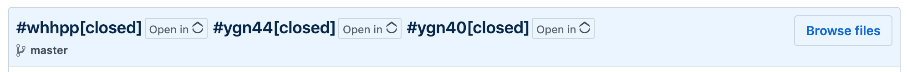
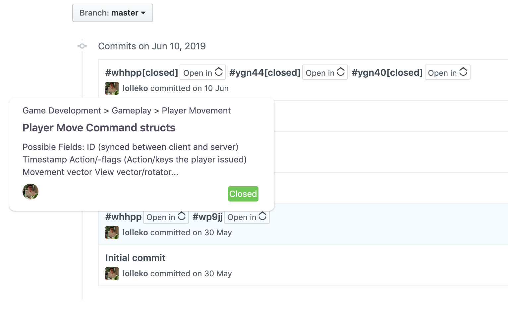

# GitUp: GitHub <-> ClickUp Browser Extension

Adds links to ClickUp tasks to GitHub commit messages.

## Without API

Task IDs are converted to `app.clickup.com/t/TASKID` links.

## With API

Entering your ClickUp token enables extra features:

* Fancy hover cards summarizing a task
* Accurate task links.
* API features will improved and become more reliable once V2 of the API is published [V2 thread](https://clickup.canny.io/20/p/api-v2)

**How to enter your token:**

1. In ClickUp goto `Settings > Apps` generate and copy your token.
2. Click the extension icon in the toolbar.
3. Enter the token and confirm.

**Note:** The token will be stored unencrypted in your browser's local storage. People with physical access to you computer will be able to retrieve the token, other websites and extension can not! (This is roughly as safe as keeping the token somewhere in a random file on your computer.)

The manual token input will be replaced by OAuth2 once implicit Authentication (`response_type=token`) is added to the ClickUP API.

**Disclaimer**

This is an innofficial project and not affiliated with ClickUp or Github.

**TODO**

* Cleanup hovercard js and html
* Gitlab support